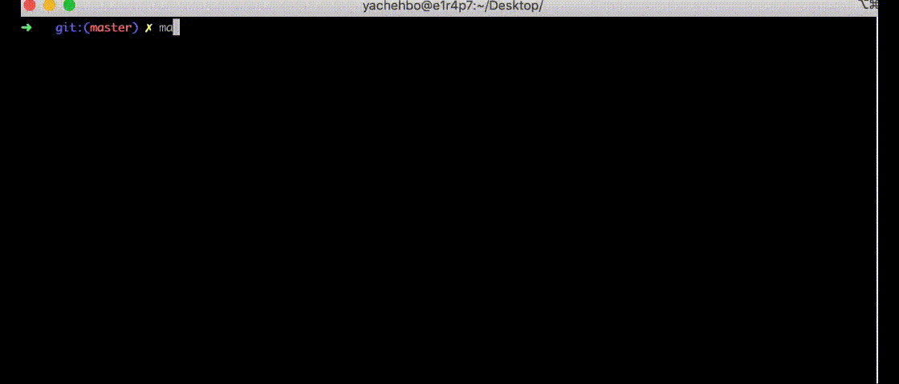
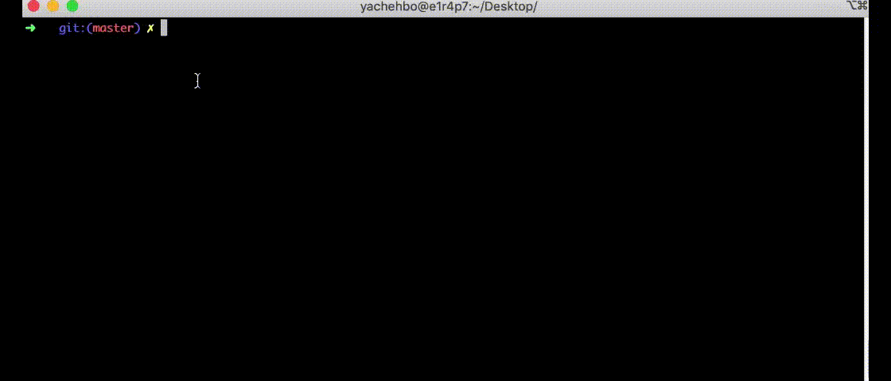
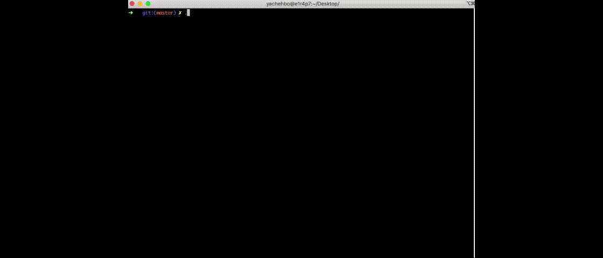

# Push_swap
Push_swap (42cursus) 2022.
A School 42 project. The purpose of this project is to create sorting algorithm.
- Actual Status : finished.
- Result        : 125%
- Observations : (null)

This is my Push_swap project from the 42 cursus, 
need help:
yachehbo@student.1337.ma

## The rules ?

• You have 2 stacks named a and b.

• At the beginning:

    ◦ The stack a contains a random amount of negative and/or positive numbers which cannot be duplicated.

    ◦ The stack b is empty.

• The goal is to sort in ascending order numbers into stack a. To do so you have the
following operations at your disposal:

    sa (swap a): Swap the first 2 elements at the top of stack a.

    sb (swap b): Swap the first 2 elements at the top of stack b.

    ss : sa and sb at the same time.

    pa (push a): Take the first element at the top of b and put it at the top of a.

    pb (push b): Take the first element at the top of a and put it at the top of b.

    ra (rotate a): Shift up all elements of stack a by 1. The first element becomes the last one.

    rb (rotate b): Shift up all elements of stack b by 1. The first element becomes the last one.

    rr : ra and rb at the same time.

    rra (reverse rotate a): Shift down all elements of stack a by 1. The last element becomes the first one.

    rrb (reverse rotate b): Shift down all elements of stack b by 1. The last element becomes the first one.

    rrr : rra and rrb at the same time.

For more informations [Subject](/push_swap.en.pdf).

## Algorithm
You can check [push-swap-algorithm](https://medium.com/@jamierobertdawson/push-swap-the-least-amount-of-moves-with-two-stacks-d1e76a71789a) if you want to read description of created algorithm.

## How to use this ?
- clone the push_swap `git clone https://github.com/youssefachehboune/push_swap.git`.
- You need to compile all source files with `make all` (For checker `make bonus`).
- To launch the program , execute `./push_swap` with a random numbers as argument.
- To launch the game with Bonus Part , execute `./checker` with a random numbers as argument , write the instructions on the input .
   `if the stack a is actually sorted and the stack b is empty, then the program must display "OK".`\
    `In every other case, it must display "KO".`\
## Demo

## Demo checker

## Demo visualizer

